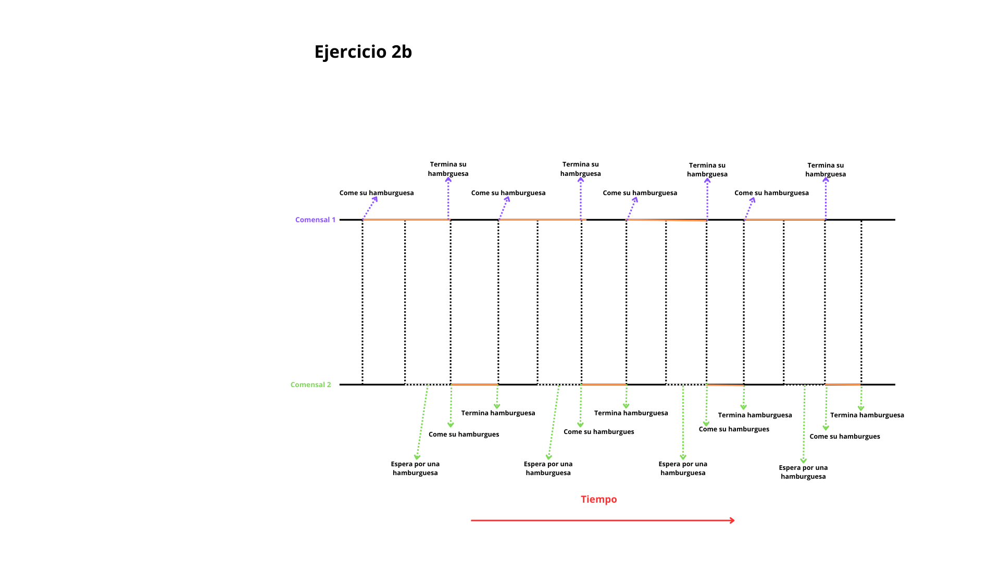

TP3:

1-a: 

    Lo que he podido notar respeco al tiempo de ejecucion:

              . La ejecución de conhilos es mas rapida (con un promedio de 4.1 segundos), comparada con la ejecución de sinhilos  (con un promedio de 5.2 segundos).

              . A pesar de ejecutar ambos programas varias veces, el tiempo de ejecucion solo varia en milesimas de segundo entre cada ejecución.

    El resultado es predecible, ya que la ejecucion con hilos suele ser mas rapida, ya que se ejecutan varios procesos al mismo tiempo.

1-b: 

    Al comparar con un compañero he notado:

              . El tiempo de ejecución de conhilos es mayor que la de sinhilos (mismo resultado que obtuve).

              . Su tiempo promedio de conhilos era de 4.02 segundos y la de sinhilos era de 5.1 segundos.

              . La diferencia de tiempo entre nuestras ejecuciones era de alrededor de 1 milesima de segundo.

1-c: 

  Lo que pasa es que al sacar los comentarios entra en los for que ciclan 1000 veces, provocando que el error, causado por ambos hilos tratando de usar la misma variable global al mismo tiempo (Zona critica), se aun mas visible. Pero, como tanto  el comentado y el no comentado acceden a la zona critica, ambos terminan cometiendo race condition.

                

2-a:

2-b:

TP4

a:

Captura de pantalla la creación de los servicios y que los servicios están
corriendo vía docker-compose ps.

b:

Captura localhost:8000 :

Captura localhost:

c:

Captura pagina de la uni:

TP5

PARTE1:

Opte por hacer la calculadora simple.

Aqui converti el script en un ejecutable:

Aqui se puede ver el script en ejecucion:

PARTE2:

Opter por la opcion de devolver el genero segun el nombre ingresado.

Aqui lo converti en ejecutable:

Aqui se puede ver el script en ejecucion:
